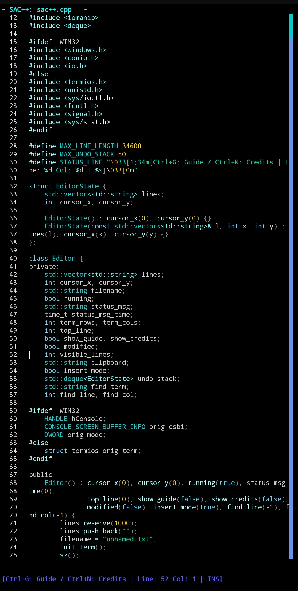

### SAC++ text editor

sac++ is a text editor. It is fast and not heavy. It is simple and easy to use.

## Features

- Fast and small
- Easy to use
- Work in terminal
- No mouse, only keyboard
- Good for writing code or text
- Can open, edit, and save files

## Why use sac++

- You want a simple text editor
- You like fast tools
- You do not need many features
- You want to use keyboard only

we still updating the editor, especially the highlight for syntax.
## Thank you

Thank you for using sac++. You can help or change the code if you want.

feedback or support: sac-service@outlook.com
